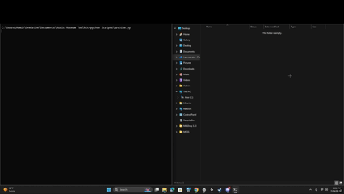

# 🎵 Music Museum Toolkit

> **Transform Spotify playlists into a permanent, versioned music archive.**

<p align="center">
  
</p>

Music Museum Toolkit is an open-source digital preservation toolkit that
preserves Spotify playlists as structured, long-term personal archives and can
reconstruct them later as new Spotify playlists.

```text
Spotify playlist
    -> permanent Collection and occurrence manifest
    -> reconstructed Spotify playlist
```

The preserved record is more than song metadata. It retains stable artifact
identity, playlist identity, exact occurrence order, duplicate placement, and an
accountable record of every local, unavailable, unsupported, or malformed entry
that Spotify cannot restore.

---

# ✨ Features

- 🎵 Live Spotify playlist preservation through the official Web API
- 🏛️ Stable Museum IDs for every permanently preserved track
- 📚 Permanent unique-artifact Collection with rich metadata
- 📋 Occurrence-level playlist manifest
- 🔢 Exact playlist order and duplicate occurrence preservation
- 🔍 Classification of local, unavailable, unsupported, and malformed entries
- ↩️ Guided playlist restoration into a new Spotify playlist
- 🔒 Private or public destination choice
- 🔑 Separate, narrowly scoped restoration authorization
- 🎯 Exact deterministic Spotify URI restoration with no fuzzy matching
- 📦 Ordered add batches of no more than 100 items
- 💾 Atomic local restoration state and per-occurrence reports
- 🔄 Safe interruption, checkpointing, and resume
- ✅ Duplicate-aware remote reconciliation and exact final verification
- 👁️ Explicit destination visibility enforcement and verification
- 📄 Permanent restoration report, including every excluded occurrence
- 🧪 Regression-tested preservation and restoration behavior
- 🔓 Fully open source

---

# Why?

Streaming services are designed for **access**, not **preservation**.

Songs disappear.

Albums change.

Metadata evolves.

Playlists are edited.

Platforms come and go.

Music Museum Toolkit exists to preserve your music collection independently of the service that originally hosted it.

Instead of asking:

> *"Can I export my playlist?"*

the project asks:

> **"How can I preserve this collection for years to come?"**

---

# Current Capabilities

Current Version: **v0.4.0 — Playlist Restoration**

The toolkit now completes both directions of the preservation loop:

- preserve a live Spotify playlist into permanent, locally owned Collection and
  manifest records;
- resume interrupted preservation without weakening stable Museum IDs or
  rewriting unchanged data;
- reconstruct the latest completed manifest into a new private or public Spotify
  playlist;
- preserve duplicate occurrences and exact restorable order;
- report every occurrence that cannot be restored and the reason;
- safely resume a partially completed restoration after reconciling the remote
  playlist against the deterministic plan.

## Running the toolkit on Windows

Double-click **Music Museum Toolkit.bat** in the repository root. The launcher
opens the application menu from the correct working directory:

```text
[1] Preserve Spotify playlist to Collection
[2] Restore Spotify playlist from Collection
[3] Exit
```

Option 1 runs the established read-only preservation workflow. Option 2 guides
the user through restoring the latest completed playlist manifest into a new
Spotify playlist. The launcher always starts from the repository root, even when
double-clicked from another working directory, and pauses on an unexpected Python
failure. The preservation workflow can still be run directly with:

```powershell
python Scripts\archive.py
```

## Preservation outputs

`Output/collection.csv` is the permanent source of truth for unique artifacts,
stable Museum IDs, and preserved metadata.

`Output/playlist_manifest.csv` is the source of truth for the most recently
completed playlist snapshot's occurrence order. It contains one row for every
returned playlist entry, including duplicate placements, local files, unavailable
items, unsupported items such as episodes, and malformed entries. Valid and
duplicate Spotify tracks map back to the same permanent Museum ID.

Interrupted scans checkpoint manifest rows in
`Output/playlist_manifest.checkpoint.csv`. The permanent manifest is validated and
replaced atomically only after a complete scan. The manifest supplies the exact
order for restoration.

## Playlist restoration

Restoration validates `collection.csv`, `playlist_manifest.csv`, and
`playlist_sync.json` before Spotify authorization. It uses only stored Spotify
track identities and preserves duplicate occurrences in their original order.

Restoration v1 follows a deliberately strict policy:

- stored Spotify track identities only;
- no fuzzy title/artist matching and no silent substitutions;
- local files, unavailable entries, episodes or other unsupported entries, and
  malformed entries are not added;
- every excluded occurrence remains in the permanent report with its reason;
- restoration always creates a new playlist and never edits the source playlist;
- a recoverable run reuses its existing run-bound destination instead of creating
  another playlist.

Local files, unavailable entries, unsupported entries, and malformed entries are
not added, but every occurrence is retained in the restoration report with its
reason. The verified manifest produces 1,274 planned items, 8 not-included rows,
and 13 add batches of at most 100 items.

Preservation remains read-only. Restoration requests its separate write
authorization only after explicit creation confirmation or when resuming a
recoverable run. Private restoration requests only `playlist-modify-private`;
public restoration requests only `playlist-modify-public`, alongside the existing
read scopes. A separate `.cache-restoration` OAuth cache keeps preservation
authorization isolated.

Spotify creation uses Spotipy's `current_user_playlist_create()`, which targets
the current `POST /me/playlists` endpoint. Spotipy 2.26.0 was verified locally.
Items are added with `playlist_add_items()` and reconciled with
`playlist_items()`.

Restoration progress is stored atomically in
`Output/restoration_state.json`. Reports are stored under
`Output/Restoration Reports/`. State and the complete occurrence report are
validated together before restoration authorization. Before every resume, the
remote URI sequence must be an exact prefix of the saved plan; final success
requires a complete exact sequence match. Partial playlists are retained for safe
resume and are never deleted automatically.

Successful add batches use an explicit destination position and Spotify's returned
snapshot ID as their checkpoint, without rereading the growing playlist after
every batch. A full destination read is reserved for initial/resume
reconciliation, ambiguous or unconfirmed add outcomes, and final verification.
Each full read checks playlist identity, ownership, name, visibility,
collaborative state, snapshot ID, and reported total both before and after paging,
and rejects any mixed or incomplete read.

A private live test exposed a Spotify discrepancy: creation returned the requested
private visibility, but the following stable read reported the new playlist as
public. The toolkit therefore explicitly enforces the confirmed visibility with
`playlist_change_details()` before restoration begins. It first requires the
destination ID, owner, name, noncollaborative state, and exact run-ID marker to
match the saved restoration. After any visibility change, bounded stable reads
must conclusively return the requested boolean value. `public=null` is not treated
as private, and no playlist items are submitted until visibility is verified.

If playlist creation has an uncertain outcome, the run-ID marker is searched
without automatically issuing a second create request. A later run searches
again; if no match is visible, the user must separately confirm that the Spotify
account was checked before retrying creation.

---

# Live Validation

The first controlled live reconstruction completed successfully on July 26,
2026:

- 1,282 source manifest occurrences;
- 1,274 ordered occurrences restored in 13 batches;
- 1,271 unique Spotify tracks plus all 3 duplicate placements;
- 8 transparently reported nonrestorable occurrences: 3 local files, 3
  unavailable entries, 2 unsupported entries, and 0 malformed entries;
- 0 failed and 0 pending report rows;
- exact contiguous source and destination positions, stored URI identity, Museum
  ID mapping, and final destination length verified.

The initial private-playlist attempt exposed a Spotify visibility discrepancy.
The toolkit stopped before adding any tracks. The hardened resume reused that
same run-bound playlist, verified private visibility, restored all 1,274 planned
occurrences, and completed exact final reconciliation.

No private playlist URL, account identity, run marker, or Spotify snapshot
identifier is published here.

## Setup and local-data safety

- Keep Spotify credentials in `.env`; never commit that file.
- Never commit OAuth caches, including `.cache` and `.cache-restoration`.
- Never commit personal `Input/`, `Output/`, or `Logs/` data, restoration reports,
  or `restoration_state.json`.
- The supplied `.gitignore` excludes these local files by default.

---

# Example Output

Each preserved song becomes a permanent artifact.

| Museum ID | Title | Artist | Album |
|-----------|--------|--------|-------|
| MMT-000001 | ... | ... | ... |
| MMT-000002 | ... | ... | ... |

Every artifact also stores:

- Source Track ID
- Release Date
- Duration
- Popularity
- Spotify URL
- Archived Timestamp
- Toolkit Version
- Preservation Status

---

# Philosophy

Music Museum Toolkit is intentionally built around digital preservation principles.

The goal is not simply to download information from Spotify.

The goal is to create a personal music archive that can continue to exist regardless of future platform changes.

Every design decision follows that philosophy.

---

# Roadmap

Planned future work includes:

- Additional archive formats
- Album artwork preservation
- Extended metadata support
- Opt-in assisted matching without weakening strict restoration defaults
- Apple Music and other service integrations
- Local-file handling
- Collection and validation UI improvements

Playlist restoration v1 is delivered in v0.4.0. See **ROADMAP.md** for longer-term
work.

---

# Contributing

Suggestions, issues, and pull requests are always welcome.

Whether you're interested in software engineering, digital preservation, metadata, or simply preserving your own music collection, contributions are appreciated.

---

# License

This project is open source.

Build your own museum.

Preserve your music.
